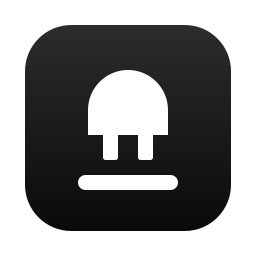
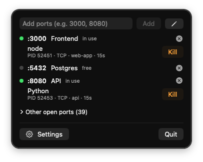

<p align="center"></p>
<h1 align="center">Unbind</h1>
<p align="center"><b>클릭 한 번으로 포트를 비워 주는 메뉴바 앱</b></p>
<p align="center"><a href="README.md">English</a> · <b>한국어</b> · <a href="README.zh.md">简体中文</a> · <a href="README.zh-Hant.md">繁體中文</a> · <a href="README.ja.md">日本語</a></p>

<p align="center"></p>

---

`Error: listen EADDRINUSE: address already in use :::3000`

익숙한 순서죠. `lsof -i :3000`을 치고, 출력을 훑어 PID를 복사하고, `kill -9` 하고, 다시 실행해요. 아니면 잊고 있던 터미널 탭, 좀비가 된 개발 서버, 지난주에 띄운 Docker 컨테이너를 찾아다니거나요.

**Unbind면 그럴 필요가 없어요.** 메뉴바에서 내가 쓰는 포트를 지켜보다가 누가 잡고 있는지 알려 주고, 클릭 한 번으로 비워 줘요.

## 왜 Unbind인가요

- **한눈에 확인**: 감시 중인 포트가 모두 비어 있으면 뽑힌 플러그, 하나라도 사용 중이면 꽂힌 플러그와 개수가 떠요. 아무것도 열 필요가 없어요
- **무엇이 돌고 있는지 정확히**: 프로세스 이름, PID, TCP/UDP, 작업 폴더, 실행 시간. 마우스를 올리면 전체 명령어가 보여요
- **부드럽게, 안 되면 강제로**: 첫 클릭은 SIGTERM을 보내 깔끔하게 정리할 기회를 주고, 다시 누르면 SIGKILL. 관리자 암호는 꼭 필요할 때만 물어요
- **Docker도 알아봐요**: Docker가 잡은 포트는 알아보기 힘든 `com.docker.backend` 대신 컨테이너 이름으로 보여 주고, `docker stop`으로 제대로 중지해요
- **내 스택대로 정리**: 포트에 라벨을 붙이고(`3000 → web`, `5432 → db`), 그룹으로 묶고, 그룹째 "모두 종료"
- **자동 종료**: 지정한 포트는 무언가 잡을 때마다 Unbind가 알아서 비워요
- **알림**: 감시 포트가 사용되기 시작하거나 비면 알려 줘요
- **숨은 포트까지**: 감시하지 않는 열린 TCP 포트도 목록으로 보여 주고, 클릭 한 번으로 감시에 추가해요
- **취향대로**: 조회 주기 1·2·5·10초, 알림 켜고 끄기, 로그인 시 실행
- **내 언어로**: English, 한국어, 日本語, 简体中文, 繁體中文. 기본은 macOS 언어 설정을 따르고(그 외 언어는 영어), 설정에서 직접 고를 수도 있어요
- **작고 네이티브**: SwiftUI 파일 하나, Electron 없음, 텔레메트리 없음, MIT 라이선스

## 요구 사항

- macOS 26 이상
- 소스에서 빌드할 때만: Command Line Tools (`xcode-select --install`). Xcode는 없어도 되고, 있으면 Liquid Glass 아이콘이 들어가요

## 설치 (Homebrew)

```sh
brew tap syc-labs/unbind https://github.com/syc-labs/Unbind
brew install --cask syc-labs/unbind/unbind
```

처음 실행할 때 macOS가 막으면:

1. 경고 창에서 **완료**를 눌러요
2. **시스템 설정 → 개인정보 보호 및 보안**을 열고 아래로 내려요
3. Unbind 안내 옆의 **그래도 열기**를 누르고 암호를 입력해요

설치하거나 업데이트한 뒤 한 번만 하면 돼요.

업데이트:

```sh
brew upgrade --cask syc-labs/unbind/unbind
```

## 삭제

메뉴바에서 **앱 종료**를 누른 뒤:

```sh
brew uninstall --cask syc-labs/unbind/unbind
```

설정과 tap까지 지우려면:

```sh
brew uninstall --zap --cask syc-labs/unbind/unbind
brew untap syc-labs/unbind
```

소스에서 빌드해 설치했다면:

```sh
rm -rf /Applications/Unbind.app
defaults delete local.unbind
```

## 소스에서 빌드

```sh
git clone https://github.com/syc-labs/Unbind.git
cd Unbind
./build.sh
cp -R Unbind.app /Applications/
open /Applications/Unbind.app
```

`build.sh`가 자체 점검, 아이콘·앱 컴파일, 애드혹 서명까지 해요.

## 사용법

1. 메뉴바의 플러그 아이콘 클릭
2. 감시할 포트 입력 (예: `3000, 8080`) 후 Enter
3. 사용 중인 포트 옆 **종료** 클릭. 안 꺼지면 한 번 더 (**강제 종료**)
4. ✏️ 버튼으로 라벨·그룹·자동 종료 편집
5. 아래 **설정**에서 조회 주기, 알림, 로그인 시 실행, 언어 설정

## 아이콘

터미널 커서(`_`)에서 뽑혀 나간 플러그 — "포트가 비었다"는 뜻이에요. 파일과 사용 규칙은 [logo/README.md](logo/README.md)를 보세요.

| 앱 아이콘 | 메뉴바 (비어 있음) | 메뉴바 (사용 중) |
|:-:|:-:|:-:|
|  |  |  |

## 라이선스

[MIT](LICENSE)
